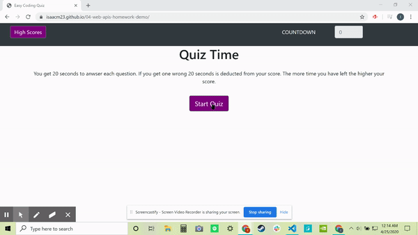

# 04-web-apis-homework-demo

## Description
This project was ment to demonstrate the use of apis to create a quiz. The quiz had to be timed and a high score had to be recorded. 

## Criteria

GIVEN I am taking a code quiz
WHEN I click the start button
THEN a timer starts and I am presented with a question
WHEN I answer a question
THEN I am presented with another question
WHEN I answer a question incorrectly
THEN time is subtracted from the clock
WHEN all questions are answered or the timer reaches 0
THEN the game is over
WHEN the game is over
THEN I can save my initials and score

### Visuals

### Usage
TO test your coding knowledge

##### Support
If you fail this quiz please get support 

##### Contributing
Me, Myself and I

###### Authors and acknowledgment
Isaac Mckittrick

